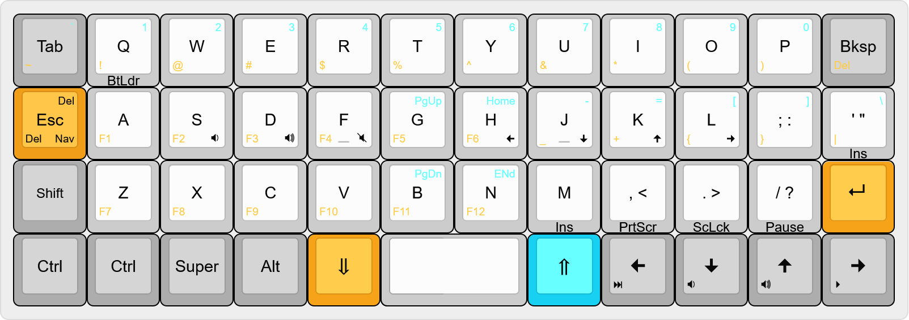

# Takieyda's Planck Rev 5 Layout

More to come.

## Description
A layout that takes the default Planck/Preonic layout and adds a little bit from the Pok3r keyboard. Semper tinker!

## Flashing Instructions
Because I keep forgetting the command line commands to compile and flash the firmware I've decided to include it here.

### Compile
Using [QMK MSYS](https://github.com/qmk/qmk_distro_msys) (after initial run of `qmk setup` command):
```shell
qmk compile --clean --keyboard planck/rev5 --keymap takieyda_rev5
```
Short form:
```shell
qmk compile -c -kb planck/rev5 -km takieyda_rev5
```
> [!NOTE]
> Using `--clean` or `-c` removes the .build directory and artifacts.

### Flash
[QMK Toolbox](https://github.com/qmk/qmk_toolbox) can be used to flash the BIN file using the **ATmega32U4** MCU option.

Alternatively, compiling and flashing can be done using QMK MSYS:
```shell
qmk flash -c -kb planck/rev5 -km takieyda_rev5
```
> [!NOTE]
> Put the board into the bootloader using *Adjust-Q* or the reset button.


<details>
<summary>Old method for prior QMK versions</summary>
 
### Compile
`make planck\rev5:takieyda_rev5`

### Flash
`make planckS\rev5:takieyda_rev5:dfu-util`
 </details>

## Features
- Layers
  - Base
  - Lower
  - Raise
  - Nav: Hold Esc to access volume controls and VIM style arrow keys.
  - Adjust: Hold Lower and Raise

## Layout

> Generated using [Keyboard-Layout-Editor.com](https://www.keyboard-layout-editor.com).